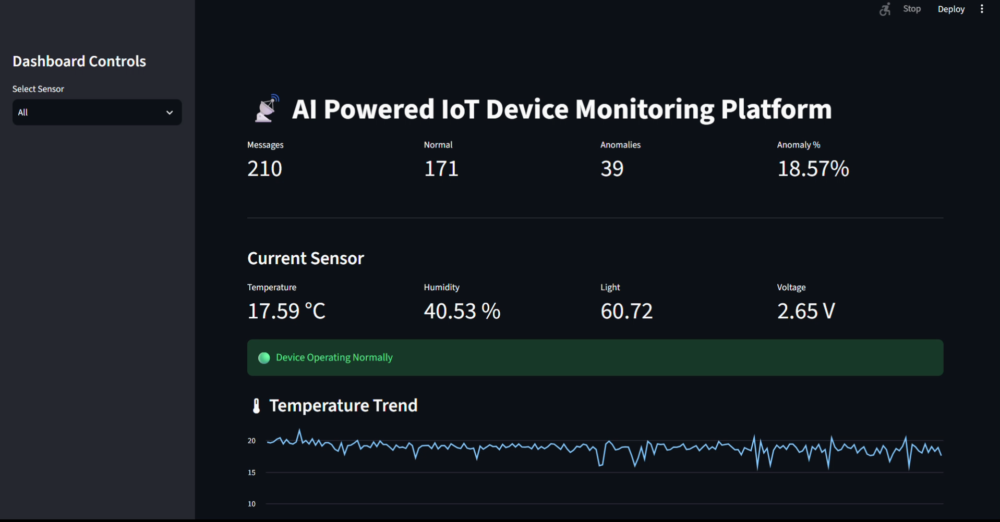
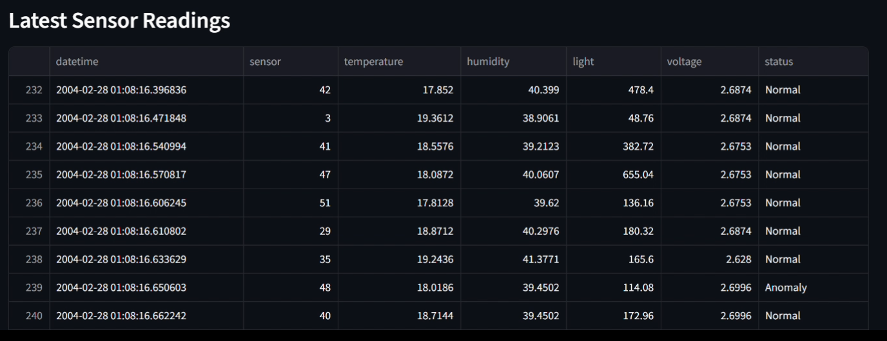
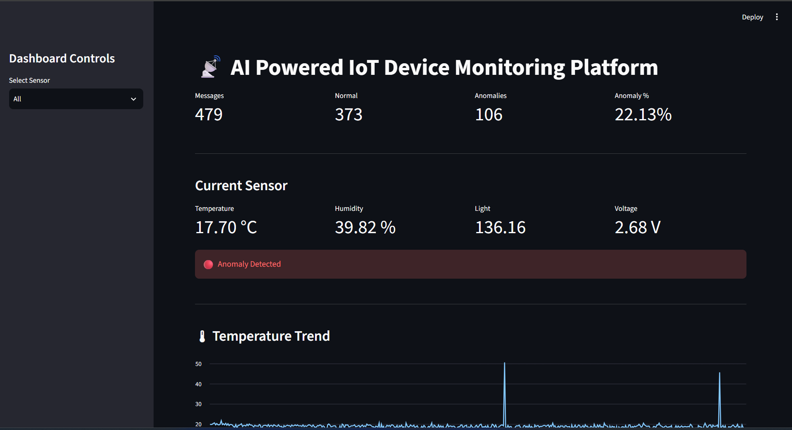
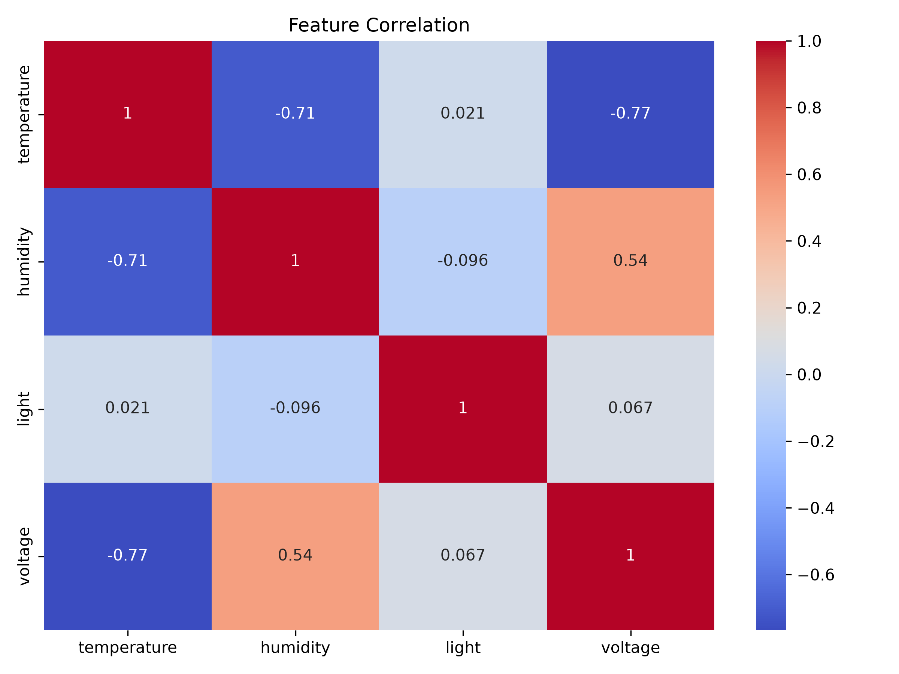
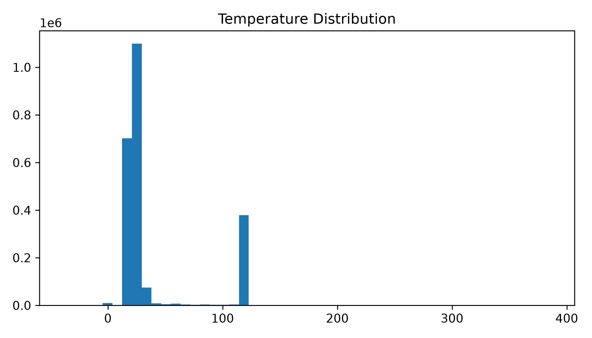
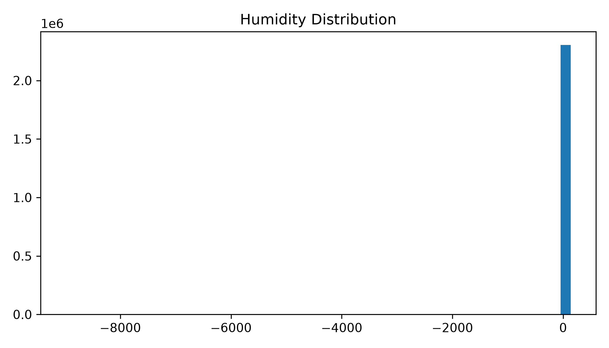
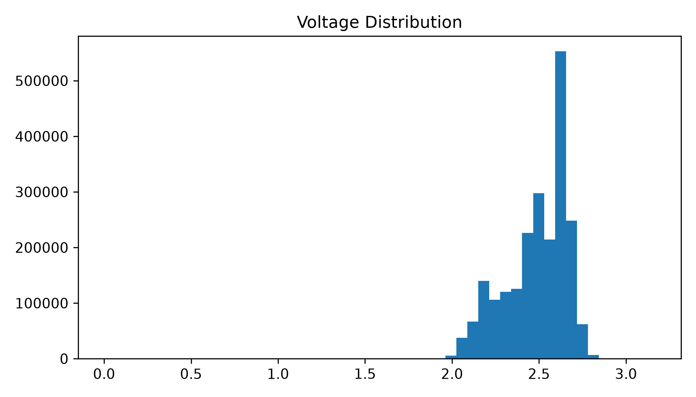
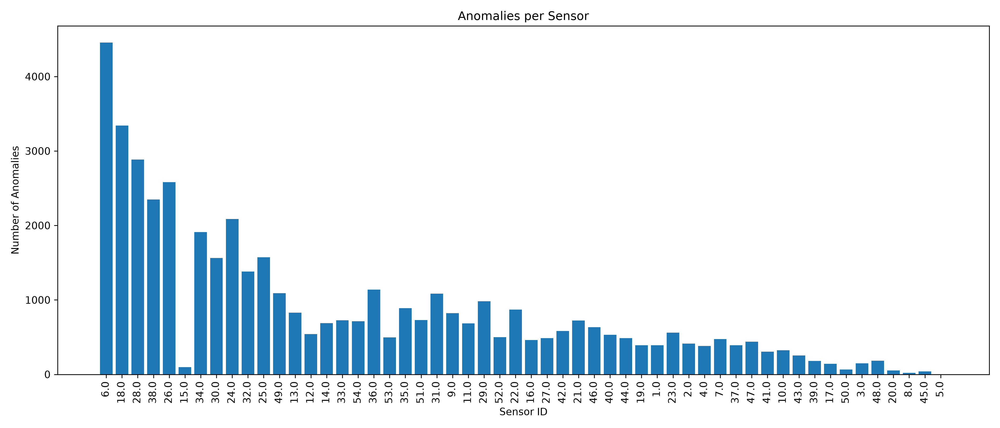

# 📡 AI Powered IoT Device Monitoring & Anomaly Detection Platform
A real-time IoT monitoring system that combines Machine Learning, MQTT messaging, and Streamlit to detect anomalies in wireless sensor network data.

The project analyzes environmental sensor readings, detects abnormal behavior using an Isolation Forest model, and visualizes live sensor data through an interactive dashboard.

## 📋 Project Overview
Wireless sensor networks generate massive amounts of environmental data. Hardware failures, battery degradation, communication issues, and environmental disturbances can produce abnormal sensor readings. This project detects such anomalies in real time using an Isolation Forest model and visualizes sensor health through an MQTT-powered live dashboard.

## 🎯 Project Highlights

- Processed **2.3 million+** real-world sensor readings.
- Monitored data from **54 wireless sensor nodes**.
- Engineered temporal features for improved anomaly detection.
- Implemented an **Isolation Forest** model for unsupervised anomaly detection.
- Built an MQTT-based real-time streaming pipeline using **Mosquitto**.
- Developed a **Streamlit dashboard** for live monitoring and visualization.
- Simulated real-world sensor faults to validate the end-to-end system.


### Key Components
- Real-time IoT data streaming using MQTT
- Machine Learning based anomaly detection
- Isolation Forest unsupervised model
- Automatic feature engineering
- Interactive Streamlit dashboard
- Live sensor monitoring
- Sensor statistics
- Historical trend visualization
- Anomaly alerts
- MQTT Publisher & Subscriber implementation

## 🎥 Demo

A short demonstration of the complete system is available below.

[▶ Watch Dashboard Demo](assets/dashboard_live.mp4)

## 📷 Dashboard

### Live Dashboard



---

### Live Monitoring



---

### Anomaly Detection



##🏛️ Architecture


Intel Berkeley Dataset
        │
        ▼
Data Loading
        │
        ▼
Preprocessing
        │
        ▼
Feature Engineering
        │
        ▼
Isolation Forest
        │
        ▼
Saved Model
        │
        ▼
MQTT Publisher
        │
        ▼
Mosquitto Broker
        │
        ▼
MQTT Subscriber
        │
        ▼
Live Prediction
        │
        ▼
Streamlit Dashboard

## 📂 Project Structure

```
AI-IoT-Device-Monitoring/
│
├── dashboard/
│   └── app.py
│
├── mqtt/
│   ├── publisher.py
│   └── subscriber.py
│
├── src/
│   ├── load_data.py
│   ├── preprocess.py
│   ├── feature_engineering.py
│   ├── train_model.py
│   ├── evaluate_model.py
│   └── visualization.py
│
├── data/
│
├── models/
│
├── plots/
│
├── assets/
│
├── config.py
├── main.py
└── requirements.txt
```

## Machine Learning Pipeline
```
Raw Dataset
      │
Cleaning
      │
Feature Engineering
      │
Isolation Forest
      │
Prediction
      │
Live MQTT Streaming
      │
Dashboard
```
## 📊 Dataset

This project uses the **Intel Berkeley Research Lab Sensor Dataset**, a publicly available dataset collected from a wireless sensor network deployed at the Intel Berkeley Research Lab.

The dataset contains environmental readings captured by multiple wireless sensor nodes (motes) over time. It is widely used for research in wireless sensor networks (WSNs), IoT analytics, anomaly detection, and machine learning.

### Dataset Features

Each record contains the following attributes:

| Feature | Description |
|----------|-------------|
| **datetime** | Timestamp when the sensor reading was recorded |
| **moteid** | Unique identifier of the wireless sensor node |
| **temperature** | Ambient temperature (°C) |
| **humidity** | Relative humidity (%) |
| **light** | Light intensity measured by the sensor |
| **voltage** | Battery voltage of the sensor node |

### Dataset Statistics

- **Total Records:** 2,303,286
- **Wireless Sensor Nodes:** 54
- **Features Used:** Temperature, Humidity, Light, Voltage
- **Additional Engineered Features:** 5
- **Total Features for Model Training:** 9

### Why This Dataset?

The Intel Berkeley dataset is well suited for anomaly detection because it contains:

- Long-term real-world environmental sensor measurements
- Data collected from multiple distributed sensor nodes
- Natural variations caused by changing environmental conditions
- Sensor faults and noisy measurements that resemble real IoT deployments

These characteristics make it an excellent benchmark for developing and evaluating machine learning models for IoT anomaly detection.

### Dataset Source

Intel Berkeley Research Lab Data

http://db.csail.mit.edu/labdata/labdata.html

> **Note:** The raw dataset is not included in this repository because of GitHub's file size limitations. Download the dataset from the official source and place it in:

```text
data/raw/sensor_data.txt
```

The project will automatically preprocess the dataset and generate the required processed files during execution.

## 🛠️ Tech Stack

| Category | Technology | Purpose |
|----------|------------|---------|
| **Programming Language** | Python 3.13 | Core application development |
| **Machine Learning** | Scikit-learn | Isolation Forest model for anomaly detection |
| **Data Processing** | Pandas | Data loading, cleaning, preprocessing, and feature engineering |
| **Numerical Computing** | NumPy | Numerical operations and feature calculations |
| **Data Visualization** | Matplotlib | Exploratory data analysis and statistical visualizations |
| **IoT Communication** | MQTT | Lightweight messaging protocol for sensor communication |
| **MQTT Broker** | Eclipse Mosquitto | Message broker for real-time data transmission |
| **MQTT Client** | Paho MQTT | Publisher and Subscriber implementation |
| **Dashboard** | Streamlit | Interactive real-time monitoring dashboard |
| **Model Serialization** | Joblib | Saving and loading trained machine learning models |
| **Version Control** | Git & GitHub | Source code management and collaboration |

# 📦 Installation & Setup

## Prerequisites

Before running the project, make sure you have the following installed:

- Python 3.10 or later (tested with Python 3.13)
- Git
- Eclipse Mosquitto MQTT Broker
- pip (Python package manager)

---

## 1. Clone the Repository

```bash
git clone https://github.com/sayaniksaha23-cloud/IoT_Device_Monitoring

cd <IoT_Device_Monitoring>
```

---

## 2. Create a Virtual Environment (Recommended)

### Windows

```bash
python -m venv venv

venv\Scripts\activate
```

### Linux / macOS

```bash
python3 -m venv venv

source venv/bin/activate
```

---

## 3. Install Dependencies

```bash
pip install -r requirements.txt
```

---

## 4. Download the Dataset

Download the **Intel Berkeley Research Lab Sensor Dataset** and place it in:

```text
data/raw/sensor_data.txt
```

The project automatically processes the dataset during execution.

---

## 5. Install Mosquitto MQTT Broker

Download and install Eclipse Mosquitto:

https://mosquitto.org/download/

After installation, start the broker before running the publisher and subscriber.

##🚀 Running the Project
## Step 1 — Train the Machine Learning Model

Run the complete preprocessing, feature engineering, model training, evaluation, and visualization pipeline.

```bash
python main.py
```

This generates:

- Cleaned dataset
- Engineered dataset
- Trained Isolation Forest model
- Prediction dataset
- Statistical plots

---

## Step 2 — Start the MQTT Broker

Open a terminal and start Mosquitto.

Example (Windows):

```bash
"C:\Program Files\mosquitto\mosquitto.exe"
```

Leave this terminal running.

---

## Step 3 — Start the MQTT Subscriber

Open a new terminal.

```bash
python mqtt/subscriber.py
```

The subscriber will:

- Receive sensor readings
- Generate runtime features
- Detect anomalies
- Store live predictions
- Update the dashboard data source

---

## Step 4 — Start the MQTT Publisher

Open another terminal.

```bash
python mqtt/publisher.py
```

The publisher:

- Simulates IoT sensor nodes
- Publishes sensor readings over MQTT
- Injects occasional anomalies for testing

---

## Step 5 — Launch the Dashboard

Open a new terminal.

```bash
streamlit run dashboard/app.py
```

The dashboard displays:

- Live sensor readings
- Real-time charts
- Anomaly alerts
- Sensor statistics
- Prediction history

The dashboard automatically refreshes while new MQTT messages are received.


# 📈 Results

The developed system successfully integrates machine learning with MQTT-based IoT communication to provide real-time sensor monitoring and anomaly detection.

## Machine Learning Results

The Isolation Forest model was trained on engineered features extracted from the Intel Berkeley Research Lab Sensor Dataset. The model successfully identifies abnormal sensor behavior without requiring labeled training data.

### Generated Outputs

The offline pipeline produces:

- Cleaned sensor dataset
- Engineered feature dataset
- Trained Isolation Forest model (`anomaly_model.pkl`)
- Prediction dataset with anomaly labels
- Sensor statistics
- Exploratory visualizations

---

## Exploratory Data Analysis

### Correlation Heatmap



The heatmap illustrates the relationships between temperature, humidity, light intensity, voltage, and engineered features.

---

### Temperature Distribution



The histogram shows the distribution of temperature readings across the dataset.

---

### Humidity Distribution



Humidity measurements reveal natural environmental variations along with a few abnormal observations.

---

### Voltage Distribution



Battery voltage remains relatively stable for most sensor nodes while a small number of abnormal voltage drops are detected.

---

### Sensor-wise Anomaly Distribution



The visualization highlights the number of anomalies detected for each wireless sensor node, helping identify sensors that experience abnormal behavior more frequently.

---

## Real-Time IoT Monitoring

The MQTT-based streaming system successfully simulates live IoT sensor communication.

The complete pipeline performs the following tasks in real time:

- Publishes live sensor readings using MQTT
- Receives sensor messages through the MQTT Subscriber
- Performs feature engineering on incoming data
- Predicts anomalies using the trained Isolation Forest model
- Stores live predictions
- Updates the Streamlit dashboard automatically

---

## Live Dashboard

### Real-Time Monitoring


The dashboard continuously displays:

- Live sensor readings
- Temperature
- Humidity
- Light intensity
- Battery voltage
- Prediction status

---

### Live Anomaly Detection


When abnormal sensor behavior is detected, the dashboard immediately highlights the anomaly, allowing users to identify potential sensor faults or environmental irregularities.

---

## System Workflow Validation

The end-to-end IoT pipeline was successfully validated by demonstrating:

- Real-time MQTT communication
- Continuous sensor data streaming
- Live anomaly prediction
- Automatic dashboard updates
- Interactive visualization of sensor statistics

The system demonstrates how machine learning can be integrated with IoT communication protocols to enable intelligent real-time monitoring of wireless sensor networks.

